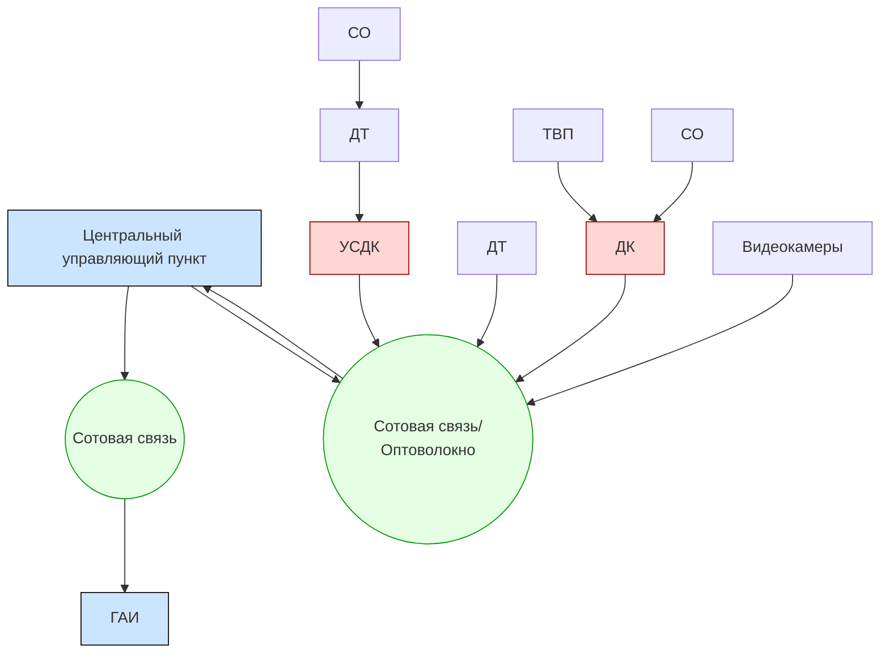
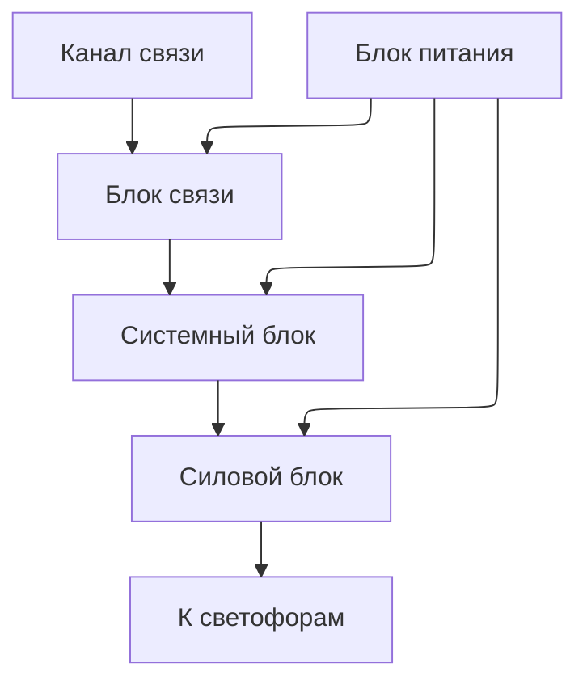
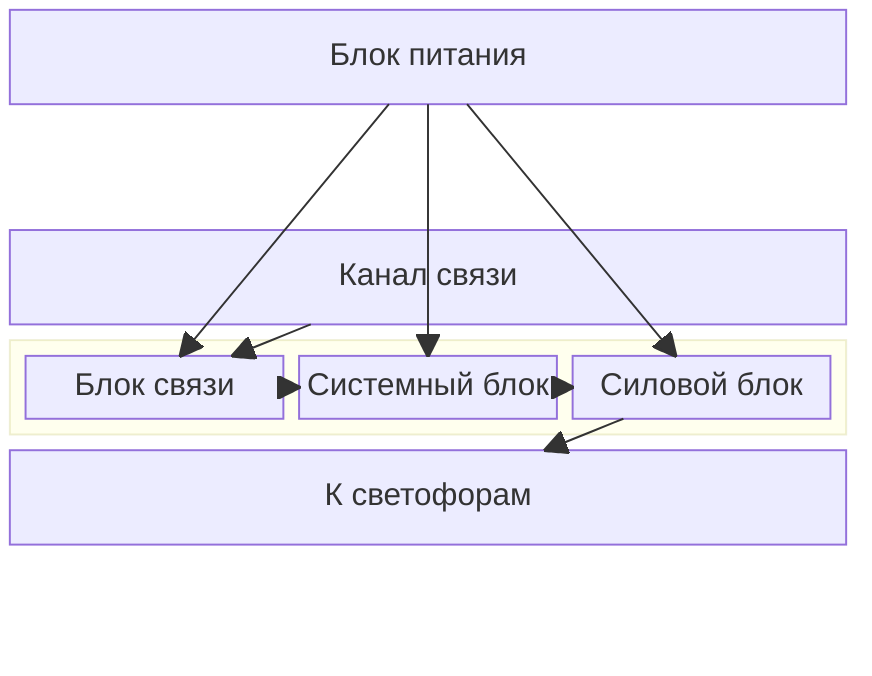
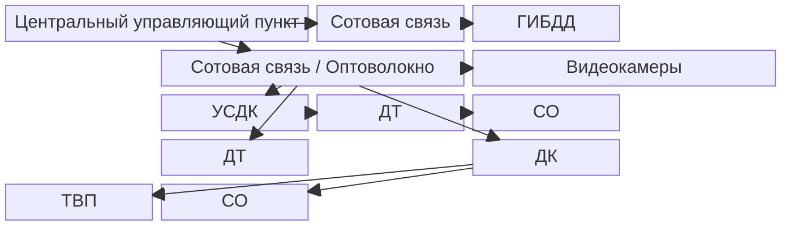

```mermaid
flowchart TB
    %% Nodes
    A[Центральный управляющий пункт] --> B((Сотовая связь))
    B --> C[ГАИ]
    A --> D((Сотовая связь/Оптоволокно))
    D --> A

    E[УСДК] --> D
    F[ДТ] --> E
    G[СО] --> F


    H[ДТ] --> D

    J[ДК] --> D
    K[ТВП] --> J
    L[СО] --> J 

    M[Видеокамеры] --> D

    %% Styling
    style A fill:#cce5ff,stroke:#000,stroke-width:1px
    style C fill:#cce5ff,stroke:#000,stroke-width:1px
    style B fill:#e5ffe5,stroke:#090,stroke-width:1px
    style D fill:#e5ffe5,stroke:#090,stroke-width:1px
    style E fill:#ffd6d6,stroke:#900,stroke-width:1px
    style J fill:#ffd6d6,stroke:#900,stroke-width:1px
    

```

```mermaid
flowchart-elk TD
    %% Main signal flow (horizontal)
    A[Канал связи] --> B[Блок связи]
    B --> C[Системный блок]
    C --> D[Силовой блок]
    D --> E[К светофорам]

    %% Power block on top with vertical lines to each block
    F[Блок питания]
    F --> B
    F --> C
    F --> D

```

```mermaid
block-beta
  columns 1
  
  F["Блок питания"]
  
  space
  A["Канал связи"]
  block:main

	  B["Блок связи"]
	  C["Системный блок"]
	  D["Силовой блок"]

  end
  	  E["К светофорам"]
  space
  A --> B
  B --> C
  C --> D
  D --> E
  F --> B
  F --> C
  F --> D

```

```mermaid
block-beta
  columns 4

  %% Row 1: Top-level entities
  central["Центральный управляющий пункт"]:2
  mobile["Сотовая связь"]:1
  gibdd["ГИБДД"]:1
  space
  %% Row 2: Communication layer
  comm["Сотовая связь / Оптоволокно"]:2
  video["Видеокамеры"]:2
  space
  %% Row 3: Left-side blocks
  usdk["УСДК"]
  dt1["ДТ"]
  so1["СО"]
  space
  %% Row 3: Center block
  dt2["ДТ"]
  space
  %% Row 3: Right-side blocks
  dk["ДК"]
  tvp["ТВП"]
  so2["СО"]

  %% Connections
  central --> comm
  central --> mobile
  mobile --> gibdd

  comm --> usdk
  comm --> dt2
  comm --> dk
  comm --> video

  usdk --> dt1
  dt1 --> so1

  dk --> tvp
  dk --> so2

```
