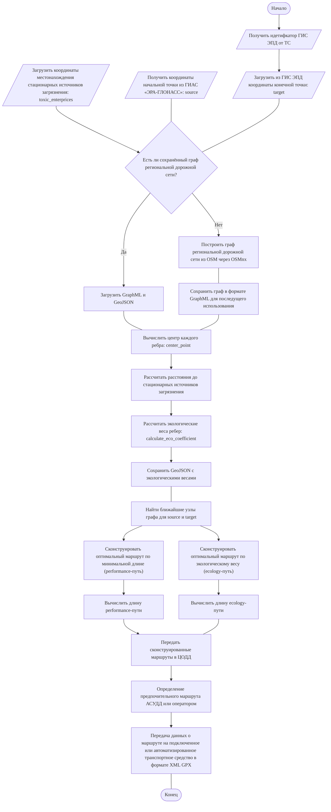
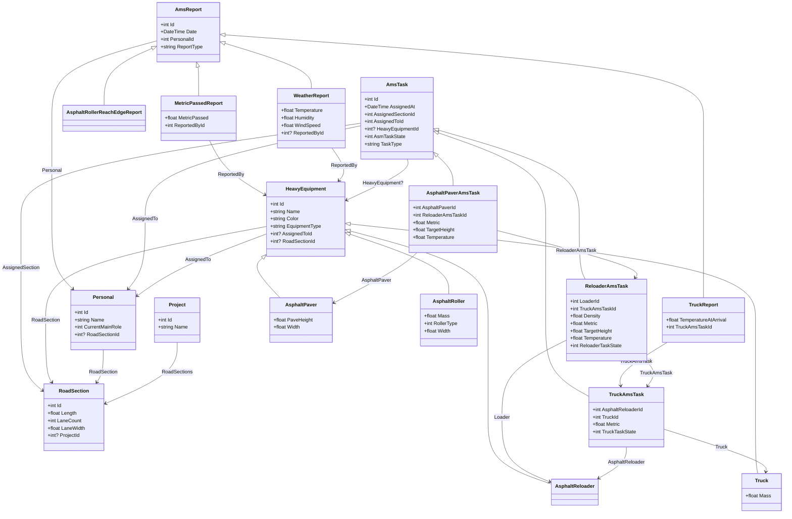

```mermaid
%%{init: {

'themeVariables': { 'fontFamily': 'Times New Roman' }}

}%%

flowchart TD

A([Начало]) --> B@{ shape: "lean-r", label: "Ввод идетифкатора в ГИС ЭПД" }

B@{ shape: "lean-r", label: "Получить идетифкатор ГИС ЭПД от ТС" } --> C@{ shape: "lean-r", label: "Получить из ГИС ЭПД координаты конечной точки: target" }

C

D@{ shape: "lean-r", label: "Получение координаты источника (GLONASS/GPS): source" }

D

E@{ shape: "lean-r", label: "Загрузить координаты стационарных источников загрязнения" }

E --> F{Есть ли закешированный граф?}

F -->|Да| G["Загрузить GraphML и GeoJSON"]

F -->|Нет| H["Собрать граф из OSM через OSMnx"]

H

I["Сохранить граф в формате GraphML для последущего использования"]

H

K1["Вычислить центр каждого ребра"]

K1 --> K2["Рассчитать расстояния до источников загрязнения"]

K2["Рассчитать расстояния до стационарных источников загрязнения"] --> K3["Рассчитать экологические веса ребер"]

K3["Рассчитать экологические веса ребер: calculate_eco_coefficient"] --> L["Сохранить GeoJSON с экологическими весами"]

G

L

N["Найти ближайшие узлы графа для source и target"]

N --> O["Построить маршрут по длине (performance-путь)"]

N --> P["Построить маршрут по экологическому весу (ecology-путь)"]

O["Сконструировать оптимальный маршрут по минимальной длине (performance-путь)"] --> Q["Вычислить длину performance-пути"]

P["Сконструировать оптимальный маршрут по экологическому весу (ecology-путь)"] --> R["Вычислить длину ecology-пути"]

Q --> S["Инициализировать карту Folium"]

S --> T["Добавить тепловую карту и маркеры источников"]

T

T["Определение предпочительного маршрута АСУДД или оператором"] --> V["Нарисовать ecology-путь (зелёная линия)"]

V["Передача данных о маршуте на подключенное или автоматизированное транспортное средство в формате XML GPX"]

Z([Конец])

  

R --- S["Передать сконструированные маршруты в ЦОДД"]

  

D --- F

C@{ shape: "lean-r", label: "Загрузить из ГИС ЭПД координаты конечной точки: target" } --- F{"Есть ли сохранённый граф региональной дорожной сети?"}

D@{ shape: "lean-r", label: "Получить координаты начальной точки из ГИАС «ЭРА-ГЛОНАСС»: source" }

E@{ shape: "lean-r", label: "Загрузить координаты местонахождения стационарных источников загрязнения: toxic_enterprices" }

H["Построить граф региональной дорожной сети из OSM через OSMnx"]

K1

V

Z

V

V["Передача данных о маршруте на подключенное или автоматизированное транспортное средство в формате XML GPX"] --- Z

I

K1

H --- I

G --- K1

I --- K1["Вычислить центр каждого ребра: center_point"]

L --- N
```

```mermaid
classDiagram
    %% Base entities
    class AmsReport {
        +int Id
        +DateTime Date
        +int PersonalId
        +string ReportType
    }
    class AmsTask {
        +int Id
        +DateTime AssignedAt
        +int AssignedSectionId
        +int AssignedToId
        +int? HeavyEquipmentId
        +int AsmTaskState
        +string TaskType
    }
    class HeavyEquipment {
        +int Id
        +string Name
        +string Color
        +string EquipmentType
        +int? AssignedToId
        +int? RoadSectionId
    }
    class Personal {
        +int Id
        +string Name
        +int CurrentMainRole
        +int? RoadSectionId
    }
    class Project {
        +int Id
        +string Name
    }
    class RoadSection {
        +int Id
        +float Length
        +int LaneCount
        +float LaneWidth
        +int? ProjectId
    }

    %% Report inheritance
    class AsphaltRollerReachEdgeReport
    class MetricPassedReport {
        +float MetricPassed
        +int ReportedById
    }
    class TruckReport {
        +float TemperatureAtArrival
        +int TruckAmsTaskId
    }
    class WeatherReport {
        +float Temperature
        +float Humidity
        +float WindSpeed
        +int? ReportedById
    }
    AmsReport <|-- AsphaltRollerReachEdgeReport
    AmsReport <|-- MetricPassedReport
    AmsReport <|-- TruckReport
    AmsReport <|-- WeatherReport

    %% Task inheritance
    class AsphaltPaverAmsTask {
        +int AsphaltPaverId
        +int ReloaderAmsTaskId
        +float Metric
        +float TargetHeight
        +float Temperature
    }
    class ReloaderAmsTask {
        +int LoaderId
        +int TruckAmsTaskId
        +float Density
        +float Metric
        +float TargetHeight
        +float Temperature
        +int ReloaderTaskState
    }
    class TruckAmsTask {
        +int AsphaltReloaderId
        +int TruckId
        +float Metric
        +int TruckTaskState
    }
    AmsTask <|-- AsphaltPaverAmsTask
    AmsTask <|-- ReloaderAmsTask
    AmsTask <|-- TruckAmsTask

    %% Equipment inheritance
    class AsphaltPaver {
        +float PaveHeight
        +float Width
    }
    class AsphaltReloader
    class AsphaltRoller {
        +float Mass
        +int RollerType
        +float Width
    }
    class Truck {
        +float Mass
    }
    HeavyEquipment <|-- AsphaltPaver
    HeavyEquipment <|-- AsphaltReloader
    HeavyEquipment <|-- AsphaltRoller
    HeavyEquipment <|-- Truck

    %% Associations
    AmsReport --> Personal        : Personal
    MetricPassedReport --> HeavyEquipment : ReportedBy
    TruckReport --> TruckAmsTask  : TruckAmsTask
    WeatherReport --> HeavyEquipment : ReportedBy

    AmsTask --> RoadSection       : AssignedSection
    AmsTask --> Personal          : AssignedTo
    AmsTask --> HeavyEquipment    : HeavyEquipment?

    AsphaltPaverAmsTask --> AsphaltPaver    : AsphaltPaver
    AsphaltPaverAmsTask --> ReloaderAmsTask : ReloaderAmsTask

    ReloaderAmsTask --> AsphaltReloader : Loader
    ReloaderAmsTask --> TruckAmsTask    : TruckAmsTask

    TruckAmsTask --> AsphaltReloader : AsphaltReloader
    TruckAmsTask --> Truck           : Truck

    HeavyEquipment --> Personal      : AssignedTo
    HeavyEquipment --> RoadSection   : RoadSection

    Personal --> RoadSection         : RoadSection
    Project --> RoadSection          : RoadSections

```
