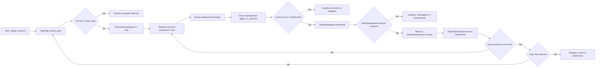

```mermaid
flowchart LR
    A[Start: retype_columns] --> B[Перебор column_spec]
    B --> C{Тип есть в type_map}
    C -- Нет --> X[Ошибка: неизвестный тип]
    C -- Да --> D[Получаем функцию по типу]

    D --> E[Перебор колонок указанного типа]
    E --> F[Вызов обернутой функции]

    F --> G[Запуск декоратора apply_on_columns]
    G --> H{Колонка есть в DataFrame}
    H -- Нет --> I[Ошибка: колонка не найдена]
    H -- Да --> J[Преобразование значений]

    J --> K{Преобразование прошло успешно}
    K -- Нет --> L[Ошибка: messagebox и исключение]
    K -- Да --> M[Вернуть преобразованную колонку]

    M --> N[Присвоение результата в DataFrame]
    N --> O{Еще колонки в этом типе}
    O -- Да --> E
    O -- Нет --> P{Еще типы данных}
    P -- Да --> B
    P -- Нет --> Q[Возврат готового DataFrame]


```

